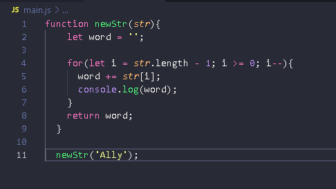

- My process: levei 1 hora e 15 minutos para fazer este algoritmo.
  - Built with: JAVASCRIPT.
  - Useful resources: https://developer.mozilla.org/pt-BR/docs/Web/JavaScript/Guide/Loops_and_iteration
- Author: Natali Marinho. 

### The challenge

Users should be able to:

- Inverter uma string sem utilizar funções prontas da linguagem

### Screenshot

## My process

Foi utilizado para este algoritmo a linguagem de programação Javascript. Pensei em inverter as strings com laço de repetição e incremento;

Primeiro passo foi a criação de uma função ‘newStr’ com o parâmetro ‘str’: 
function newStr(str){}
Então criei uma variável vazia que irá receber a string:
let word = ‘’
Então, para fazer a inversão utilizei o laço de repetição FOR, no qual a variável i recebeu o valor da largura da str - 1 (é o que vale a última letra da palavra enviada), enquanto i for maior ou igual a 0 o laço irá continuar.
Por último tem o decremento da variável i após cada iteração:
for(let i = str.length - 1; i >= 0; i--)

Dentro do loop a variável word irá receber ela mesma mais a str e com todas as letras que estiverem no índice:
word += str[i]
Por último coloquei um return junto com a variável word que recebeu a string já invertida
return word
Para vermos o resultado, coloquei um console.log(‘word’)

Para execução da função, chamei ela ao final do código
newStr(‘hello’)

## Author
- Frontend Mentor - [@natsmarinho](https://www.frontendmentor.io/profile/natsmarinho)
- Twitter - [@natsmarinho](https://www.twitter.com/natsmarinho)
- Instagram - [@natsmarinho](https://www.instagram.com/natsmarinho/)
- Linkedin - [@natsmarinho](https://www.linkedin.com/in/natsmarinho)
